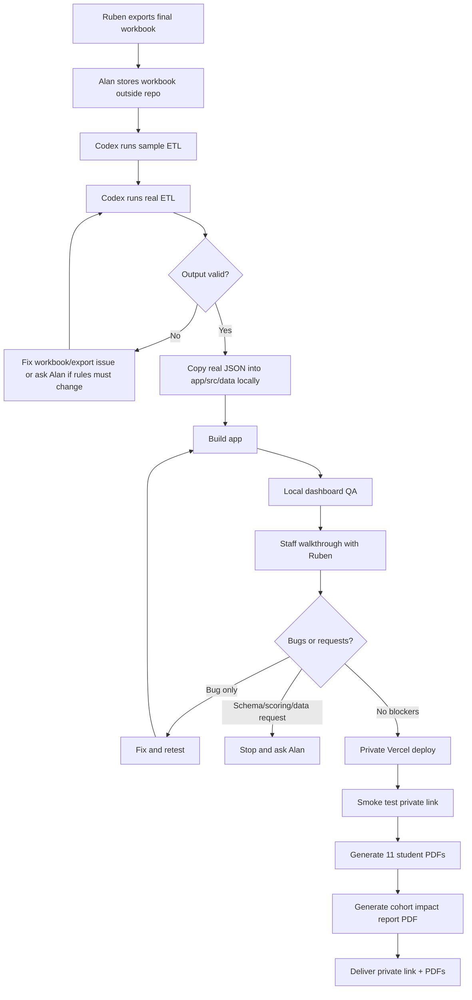
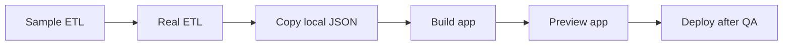

# Week 5 Operator Map

This is the visual version of what happens next. Use it when you want to know what you need to do, what Codex can do, and when to stop for a decision.

The detailed checklist lives in `docs/week-5-testing-deployment.md`.

## Where We Are

```text
DONE                      CURRENT                         NEXT
----                      -------                         ----
Build works          ->   Need real workbook          ->   Validate real data
PDF buttons work     ->   Need local QA               ->   Walk Ruben through it
AI Self-Check works  ->   Need private deploy         ->   Deliver PDFs + link
Docs committed       ->   Real data must stay local   ->   Do not commit real JSON
```

## What I Need From You First

```text
+---------------------------------------------------------------+
| 1. Put Ruben's final .xlsx somewhere outside this repo         |
|                                                               |
|    Good: C:\Users\Alan's PC\Desktop\FLI Private Data\...      |
|    Avoid: fli-scorecard\...                                  |
+-------------------------------+-------------------------------+
                                |
                                v
+---------------------------------------------------------------+
| 2. Send Codex the exact workbook path                          |
|                                                               |
|    Example:                                                    |
|    C:\Users\Alan's PC\Desktop\FLI Private Data\final.xlsx     |
+-------------------------------+-------------------------------+
                                |
                                v
+---------------------------------------------------------------+
| 3. Confirm Codex can process it locally                        |
|                                                               |
|    This creates local JSON for QA/deploy, but it is not        |
|    committed to git.                                           |
+---------------------------------------------------------------+
```

## Big Picture Flow



## Who Does What

| Step | Alan | Codex | Ruben |
|---|---|---|---|
| Provide final workbook | Get file from Ruben and place it outside repo | Wait for exact path | Export workbook |
| Validate workbook | Confirm use of real data locally | Run ETL and validate 11-student JSON | Clarify workbook issues if needed |
| QA dashboard | Review output with Codex | Build, preview, and inspect flows | Join walkthrough |
| Bug triage | Decide what is a bug vs. scope change | Fix confirmed bugs only | Report issues/examples |
| Deploy | Confirm Vercel access/path | Deploy or guide deployment | Receive private link |
| Deliver PDFs | Confirm filenames/delivery channel | Help generate/check PDFs | Receive final package |

## The Stop Signs

Stop and make a decision before continuing if any of these happen:

```text
              STOP
        +--------------+
        | Do not guess |
        +--------------+
              |
              v
+--------------------------------------------------+
| Ruben asks to add/remove/rename data fields       |
| Ruben asks to change certification logic          |
| Ruben asks to change scoring thresholds/weights   |
| The workbook is missing required sheets           |
| The workbook needs recollection/re-export         |
| A new dependency seems necessary                  |
+--------------------------------------------------+
```

Required sheets:

```text
Self-Eval     Peer-Eval     Staff-Eval     Gates
```

Required output checks:

```text
students                  = 11
score arrays per student  = 22 values each
certified count           = matches ETL stdout
avg weighted score        = matches ETL stdout
real data in git          = no
```

## Local Commands We Will Run



```bash
cd etl
python etl.py sample_data/sample_cohort.xlsx
python etl.py "C:/path/outside/repo/ruben-final-cohort.xlsx"
copy cohort_data.json ..\app\src\data\cohort_data.json
cmd /c npm --prefix ..\app run build
```

Preview:

```bash
cd app
npm run preview
```

Git safety check:

```bash
git status --short
```

If `app/src/data/cohort_data.json` contains real student data, do not commit it.

## Walkthrough Script

```text
1. ETL summary
   - 11 students?
   - certified count plausible?
   - average score plausible?

2. Screen 1: Cohort table
   - sorting works
   - badges look right
   - click a row

3. Screen 2: Student deep dive
   - certified student
   - conditional student, if present
   - not-certified student, if present
   - export student PDF

4. Screen 3: Cohort analytics
   - heatmap
   - divergence chart
   - strongest/weakest competencies
   - export cohort PDF

5. AI Self-Check
   - generate prompt
   - confirm high-score probing question appears for 4 or 5
```

## Issue Capture Card

Use this format during Ruben's walkthrough:

```text
Issue:
Screen/artifact:
Student/example:
Expected:
Actual:
Severity: blocker | high | medium | low
Decision needed from Alan? yes | no
```

## Final Delivery Package

```text
+----------------------------------------------------+
| Private Vercel link                                |
| 11 student credential PDFs                         |
| 1 cohort impact report PDF                         |
| AI Self-Check file or instructions                 |
+----------------------------------------------------+
```

PDF filenames:

```text
FLI_Spring_2026_[Student_Name]_Credential.pdf
FLI_Spring_2026_Cohort_Impact_Report.pdf
```

## Your Immediate Next Action

```text
Find Ruben's final workbook
        |
        v
Move it outside the repo
        |
        v
Send Codex the exact file path
        |
        v
Say: "Yes, process it locally and do not commit real data."
```
